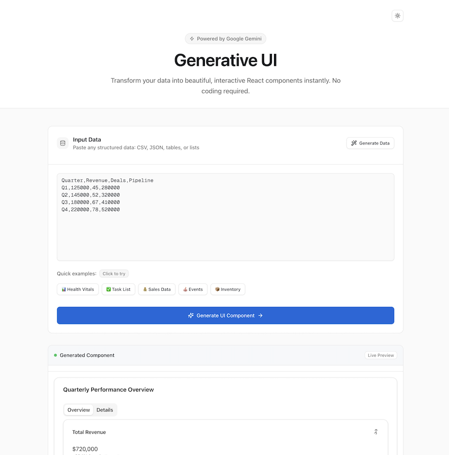

# Generative UI

<div align="center">
  
  
  
  
  
</div>

<div align="center">
  <h3>Transform your data into beautiful, interactive React components using AI</h3>
  <p>Powered by Google's Gemini AI • Real-time streaming </p>
</div>

<div align="center">
  <a href="#demo">View Demo</a> •
  <a href="#features">Features</a> •
  <a href="#quick-start">Quick Start</a> •
  <a href="#deployment">Deploy</a> •
  <a href="#contributing">Contributing</a>
</div>

---

## 🎯 Overview

Generative UI is an innovative application that leverages Google's Gemini AI to automatically generate React components from your data. Simply paste CSV, JSON, or plain text, and watch as AI transforms it into beautiful, interactive visualizations. 

### 🚀 Key Highlights

- **Zero-config component generation** - No templates or configurations needed
- **Real-time streaming** - See components materialize as they're generated
- **Production-ready output** - Generated components use shadcn/ui and Recharts
- **Dark/Light theme support** - Seamless theme switching with system preference detection
- **Type-safe** - Full TypeScript support with proper type inference
- **Edge-optimized** - Runs on Vercel Edge Runtime for maximum performance

## 📸 Demo

🔗 **[Try the Live Demo](https://generative-ui-cyan.vercel.app/)**

<details>
<summary>View Screenshots</summary>

### Light Mode


</details>

## ✨ Features

### Core Capabilities

- **🤖 AI-Powered Generation** - Transforms raw data into React components using Gemini 2.5 Flash Lite
- **📊 Smart Visualizations** - Automatically selects appropriate chart types based on data structure
- **🌓 Theme Support** - Beautiful dark and light themes with smooth transitions
- **🎲 Sample Data Generation** - AI can create realistic datasets for testing

### Supported Data Formats

- **CSV** - Comma-separated values with headers
- **JSON** - Objects, arrays, and nested structures
- **Plain Text** - Markdown tables, lists, or structured text
- **Markdown** - Tables and formatted content

### Generated Component Types

- 📊 **Charts** - Bar, Line, Area, Pie, Radar, and Composed charts
- 📋 **Tables** - Sortable, filterable data tables with pagination
- 🃏 **Cards** - Metric cards, stat cards, and info cards
- 📈 **Dashboards** - Multi-widget analytical dashboards
- 🗂️ **Tabs** - Organized multi-view interfaces
- 📝 **Lists** - Task lists, timelines, and activity feeds

## 🛠️ Tech Stack

### Frontend
- **[Next.js 15](https://nextjs.org/)** - React framework with App Router
- **[React 19](https://react.dev/)** - Latest React with improved performance
- **[TypeScript](https://www.typescriptlang.org/)** - Type safety and better DX
- **[Tailwind CSS v4](https://tailwindcss.com/)** - Utility-first styling
- **[shadcn/ui](https://ui.shadcn.com/)** - High-quality React components
- **[Recharts](https://recharts.org/)** - Composable charting library

### AI & Backend
- **[Google Gemini AI](https://ai.google.dev/)** - Gemini 2.5 Flash Lite model
- **[Vercel AI SDK](https://sdk.vercel.ai/)** - Streaming AI responses

### Development
- **[next-themes](https://github.com/pacocoursey/next-themes)** - Theme management
- **[Lucide Icons](https://lucide.dev/)** - Beautiful open-source icons

## 🚀 Quick Start

### Prerequisites

- Node.js 18.17 or later
- npm, yarn, or pnpm
- Google AI Studio API key

### Installation

1. **Clone the repository**
   ```bash
   git clone https://github.com/codeer-ai/generative-ui.git
   cd generative-ui
   ```

2. **Install dependencies**
   ```bash
   npm install
   # or
   yarn install
   # or
   pnpm install
   ```

3. **Set up environment variables**
   ```bash
   cp .env.example .env.local
   ```

4. **Add your Google API key**
   
   Get your API key from [Google AI Studio](https://aistudio.google.com/app/apikey) and add it to `.env.local`:
   ```env
   GOOGLE_API_KEY=your_api_key_here
   ```

5. **Start the development server**
   ```bash
   npm run dev
   # or
   yarn dev
   # or
   pnpm dev
   ```

6. **Open the app**
   
   Visit [http://localhost:3000](http://localhost:3000) in your browser

## 📖 Usage Guide

### Basic Usage

1. **Input your data** in one of the supported formats:
   ```csv
   Month,Revenue,Expenses
   Jan,50000,30000
   Feb,60000,35000
   Mar,75000,40000
   ```

2. **Click "Generate UI"** to create a component

3. **View the result** - Your component will render below with full interactivity

### Advanced Features

#### Generate Sample Data
Click "Generate Sample Data" to let AI create realistic datasets:
- Fitness tracking with activities and metrics
- Library book collections with ratings
- Restaurant order management
- Weather monitoring across locations
- Employee directories with departments
- And more...

#### Customize Output
The AI understands context, so you can guide generation:
- Add a title row for dashboard layouts
- Include metadata for specific chart types
- Use descriptive column names for better components

### Example Inputs

<details>
<summary>Sales Dashboard CSV</summary>

```csv
Product,Q1,Q2,Q3,Q4,Total
Widget A,12500,15000,18000,22000,67500
Widget B,8000,9500,11000,13500,42000
Widget C,5500,6000,7500,9000,28000
```
</details>

<details>
<summary>Task Management JSON</summary>

```json
[
  {
    "task": "Implement user authentication",
    "status": "completed",
    "priority": "high",
    "assignee": "John Doe"
  },
  {
    "task": "Design dashboard layout",
    "status": "in-progress",
    "priority": "medium",
    "assignee": "Jane Smith"
  }
]
```
</details>

## 🏗️ Architecture

### System Design


### Key Components

#### `/app/api/generate/route.ts`
Handles AI component generation with streaming support:
- Validates input data
- Constructs optimized prompts
- Streams component code
- Implements error recovery

#### `/components/dynamic-component.tsx`
Runtime component renderer with:
- Babel transformation
- Error boundaries
- Component validation
- Auto-fixing common issues

#### `/app/page.tsx`
Main application interface featuring:
- Real-time updates
- Theme-aware styling
- Responsive layout

### AI Prompt Engineering

The system uses carefully crafted prompts that:
- Specify component requirements
- Include shadcn/ui component imports
- Define Recharts chart configurations
- Handle edge cases and data validation

## 🚀 Deployment

### Deploy to Vercel (Recommended)

[](https://vercel.com/new/clone?repository-url=https%3A%2F%2Fgithub.com%2Fcodeer-ai%2Fgenerative-ui&env=GOOGLE_API_KEY&envDescription=Google%20API%20key%20for%20Gemini%20AI&envLink=https%3A%2F%2Faistudio.google.com%2Fapp%2Fapikey&project-name=generative-ui&repository-name=generative-ui)

### Manual Deployment

1. **Fork or clone the repository**
2. **Push to your GitHub account**
3. **Import to Vercel**:
   - Go to [vercel.com/new](https://vercel.com/new)
   - Import your repository
   - Add environment variables
   - Deploy

### Environment Variables

| Variable | Description | Required |
|----------|-------------|----------|
| `GOOGLE_API_KEY` | Google AI Studio API key | ✅ Yes |

## 🧪 Development

### Project Structure

```
generative-ui/
├── app/
│   ├── api/
│   │   ├── generate/          # Component generation endpoint
│   │   └── generate-data/     # Sample data generation
│   ├── fonts/                # Local font files
│   ├── globals.css           # Global styles & theme tokens
│   ├── layout.tsx            # Root layout with providers
│   └── page.tsx              # Main application UI
├── components/
│   ├── ui/                   # shadcn/ui components
│   ├── dynamic-component.tsx # Runtime renderer
│   ├── theme-provider.tsx   # Theme context
│   └── theme-toggle.tsx     # Theme switcher
├── lib/
│   └── utils.ts             # Utility functions
├── public/                  # Static assets
├── .env.example            # Environment template
├── components.json         # shadcn/ui config
├── next.config.ts         # Next.js configuration
├── tailwind.config.ts     # Tailwind configuration
└── vercel.json           # Deployment config
```

### Available Scripts

```bash
# Development
npm run dev          # Start dev server
npm run build       # Build for production
npm run start       # Start production server
npm run lint        # Run ESLint
npm run type-check  # Run TypeScript compiler

# Component Management
npx shadcn@latest add [component]  # Add shadcn/ui components
```
